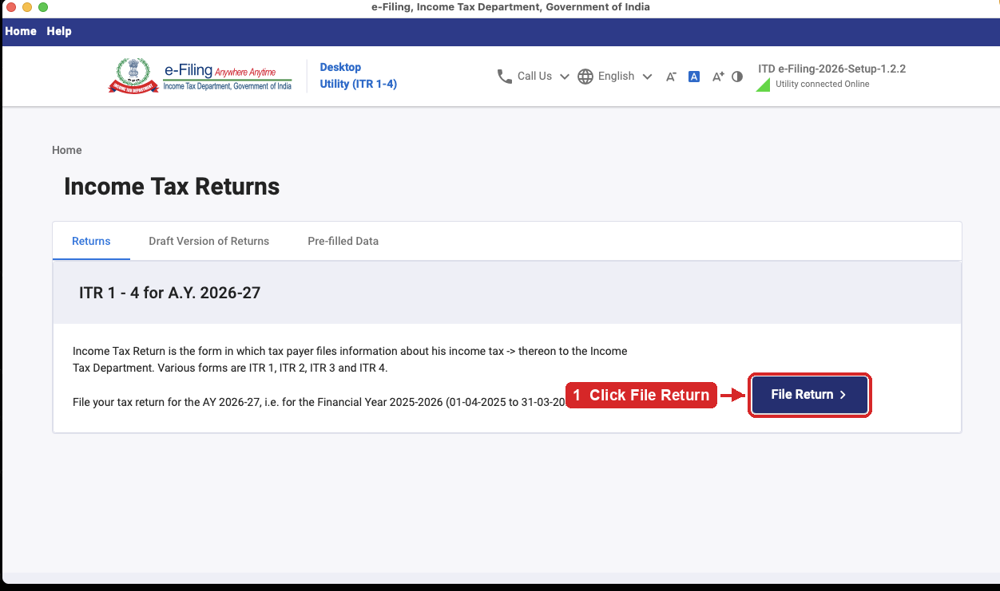
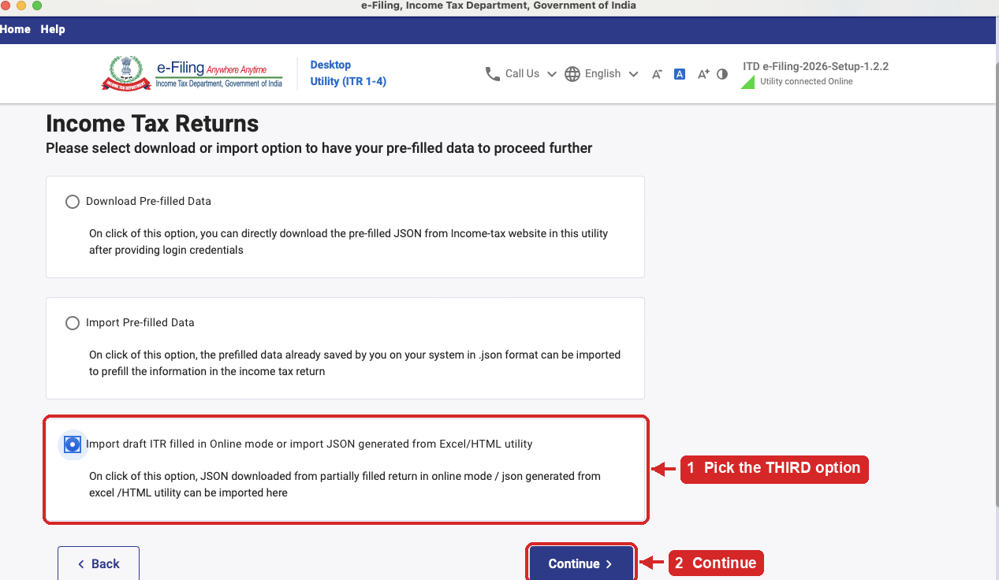
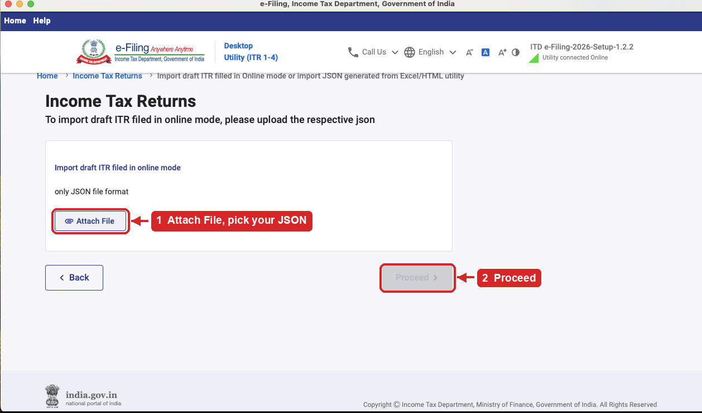

# itr2-india

A Claude Code skill for filing an Indian ITR-2 for AY 2026-27 (FY 2025-26).

Filing ITR-2 by hand is mostly a reconciliation problem. Form 16, AIS, Form 26AS
and your broker's P&L describe the same year from four angles, and none of them
agree. The work is getting them to agree, classifying each capital gain under
the right section, and then not fat-fingering the transfer into the form.

This skill covers one profile properly rather than every profile badly:
**salaried, resident, with listed equity or mutual fund gains and deposit
interest.** It was built while filing a real return, so the parts that usually
go wrong are the parts it has the most to say about.

## What you get

Claude reads the skill and then knows how to do the whole thing with you: work
out whether ITR-2 is even the right form, reconcile your documents, classify
gains under the FY 2025-26 rules, compare both tax regimes, and produce either a
schedule-by-schedule filling guide or a validated JSON.

Underneath that are four scripts you can also run yourself:

| Script | What it does |
| --- | --- |
| `scripts/build_worksheet.py` | Turns a consolidated capital-gains ledger into ITR-2 figures. Applies s.112A grandfathering and the 1,25,000 exemption once across all brokers, then emits Schedule 112A and the Table F quarter split. |
| `scripts/compute_tax.py` | Computes both regimes side by side, with 234B and 234C notes, and tells you which one is cheaper. |
| `scripts/build_itr2_json.py` | Builds the return JSON and validates it against the department's published schema. |
| `scripts/patch_prefill_json.py` | Inspects and edits the portal's pre-filled JSON, discovering node paths instead of assuming them. |
| `scripts/package_for_claude_app.py` | Packages the skill as a ZIP the Claude app will accept. Only needed if you use claude.ai rather than Claude Code. |

`schema/` holds the department's own ITR-2 schema and validation rules for AY
2026-27, so validation happens on your machine instead of by rejection message.

## Install

Two ways in, depending on which Claude you use.

### Claude Code

Skills live in `~/.claude/skills/`, one folder each. Clone this repo straight
into that folder:

```bash
git clone <repo-url> ~/.claude/skills/itr2-india
```

For a project-local install, use `.claude/skills/itr2-india` inside the project
instead. Either way, Claude picks it up on the next session. Ask it something
like "help me file my ITR-2" and it will load.

The scripts need Python 3.9 or later. Schema validation needs one package:

```bash
pip install jsonschema
```

Everything else is standard library.

### Claude app, at claude.ai

Skills work in the app too, on the Free, Pro, Max, Team and Enterprise plans.
They run on Claude's code execution, so turn that on first.

1. **Settings > Capabilities**, and enable "Code execution and file creation".
   On Team and Enterprise an owner has to enable skills in
   **Organization settings > Skills** before members can.
2. Get `itr2-india.zip`. Download it from the
   [latest release](../../releases/latest), which is the whole of this step if
   you would rather not touch a terminal.

   If you have cloned the repo and changed something, rebuild it instead:

   ```bash
   python scripts/package_for_claude_app.py
   ```

   Either way, do not zip the folder by hand. The app requires the skill folder
   to sit at the root of the ZIP, and it caps the description at 200 characters,
   which the full one exceeds. The script handles both and leaves the repo
   untouched.
3. Go to **Customize > Skills**, click **+**, then **+ Create skill**, then
   **Upload a skill**, and give it the ZIP.
4. Start a chat and describe what you want, along the lines of "help me file my
   ITR-2 for AY 2026-27". Claude reaches for the skill on its own. You can also
   toggle skills for a conversation from the Skills menu in the chat.

A skill you upload is private to your own account unless your organization
turns on sharing.

Two differences worth knowing before you go this route. Your documents get
attached to a chat instead of sitting in a folder on your machine, so think
about whether you want a PAN, an Aadhaar number and a full year of bank
interest going up to a chat at all. And the filing itself still happens on your
computer, because the Common Offline Utility is a desktop program. The app can
take you all the way to a validated JSON and a schedule-by-schedule guide, and
then you finish in the utility either way.

## Use it

Start by collecting your documents. Claude will ask for these, but you can get a
head start:

* Form 16 from your employer
* Form 26AS from the e-filing portal, which redirects to TRACES
* AIS and TIS from the portal, under Services
* Capital gains statements from every broker, plus CAMS and KFintech for mutual
  funds. Miss one and gains go missing.
* Bank interest certificates for FD and RD interest

The AIS PDF password is your PAN in lowercase followed by your date of birth as
DDMMYYYY, with no spaces.

### Where to put them

Make a `work/` folder in the repo and keep everything in there:

```bash
mkdir -p work
```

```
work/
  AIS.pdf                 downloaded from the portal
  TIS.pdf
  26AS.txt                or the PDF, either is fine
  Form16.pdf
  PNL_REPORT.xls          your broker's tax P&L, one per broker
  CAMS.xlsx               mutual fund statements, CAMS and KFintech both
  prefill.json            the portal's pre-filled data, if you want it
  ledger.csv              the consolidated ledger you build in step 1
```

`work/` is already ignored by git and always will be, so nothing in it can be
committed by accident. The scripts write their output there too, which keeps
your documents and your working files in one place that never leaves your
machine. Point Claude at that folder and it will read what it needs.

Do not put documents in `references/`, `scripts/`, `assets/` or `schema/`.
Those four are tracked, and anything you drop in them is a candidate for your
next commit.

Once you have filed, keep the folder. If a query arrives eighteen months later,
the statements you filed from are the answer to it.

### Running it

The usual path is:

```bash
# 1. Put every broker row into one CSV, shaped like assets/ledger_template.csv
python scripts/build_worksheet.py ledger.csv --outdir work/

# 2. Fill in assets/taxpayer_input_template.json, paste in the capital_gains
#    block from work/worksheet.json, and compare regimes
python scripts/compute_tax.py taxpayer.json --json work/computation.json

# 3. Optional, if you want a JSON rather than typing into the portal
cp assets/itr2_json_input_template.json my_return.json
python scripts/build_itr2_json.py my_return.json -o filled.json
```

Step 1 prints your total sale consideration. Tie that to the AIS figure for
"Sale of securities and units of mutual fund". If it falls short, a broker
statement is missing. AIS reports sale value and not profit, so it will never
match your P&L, and chasing that match wastes hours.

## About uploading the JSON

The portal's direct JSON upload only accepts files stamped with a registered
Software Provider ID, which the department issues to approved vendors. A JSON
you built yourself gets rejected with "Invalid Software Provider ID" before
anyone looks at the figures.

So the JSON is not the upload. It is the input to the official Common Offline
Utility, which does have a registered ID and can file on your behalf.

**Download it here:**
[Common Offline Utility (ITR 1, 2, 3 and ITR 4)](<https://www.incometax.gov.in/iec/foportal/downloads#common%20offline%20utility%20(itr%201,2,3%20and%20itr%204)>).
It is one program covering ITR-1 through ITR-4, so the ITR-2 you want is inside
it. Install it and sign in, and it will say "Utility connected Online" in the
top right.

Then three clicks, in this order.

**1. File Return**, on the "ITR 1 - 4 for A.Y. 2026-27" card.



**2. Import draft ITR filled in Online mode or import JSON generated from
Excel/HTML utility**, which is the third radio button, then **Continue**. Take
the third one, not "Import Pre-filled Data". Pre-filled data is the portal's
summary of what it already knows about you, which is a different file and does
not contain your return.



**3. Attach File**, pick the JSON you built, then **Proceed**.



Everything arrives pre-filled, so you spend a few minutes reviewing instead of
an hour typing. Work through the schedules, then let the utility validate and
recompute before you submit. If its tax figure differs from `compute_tax.py`,
the utility is right and something upstream is misclassified. That rule has no
exceptions.

## The thing that surprises everyone

Under the new regime, income up to 12,00,000 pays no tax, because the s.87A
rebate wipes it out. That rebate does not reach capital gains. Tax on s.111A
short-term gains at 20% and s.112A long-term gains at 12.5% stays payable in
full.

So someone earning well under 12 lakh who sold some shares still owes tax, often
a few thousand rupees they were not expecting. This is the most common question
of the season and the answer is that the law is written that way on purpose.

## Your documents stay yours

The `.gitignore` here ignores everything by default and then allows back only
the project files. That is deliberate. Tax documents land in this folder while
you work, and they carry a PAN, an Aadhaar number, bank account numbers and a
home address. A deny list only protects you from the filenames someone thought
of in advance.

Your working files go in `work/`, which is never tracked. If you add a project
file that should be committed, add an explicit rule for it in `.gitignore`.

## Layout

```
SKILL.md            what Claude reads
references/         tax rules, document map, schedule-by-schedule detail
scripts/            the four scripts above
assets/             input templates to copy and edit
schema/             the department's ITR-2 schema and validation rules
```

## STOP. Read this before you file.

> ### This is a filing aid. It is not a chartered accountant and nothing here is tax advice.
>
> **You are signing the return, not this repo.** A wrong figure is your
> liability, your notice and your penalty. Check every number before you submit.

**Never submit a number this repo produced without the official utility
agreeing.** Import into the Common Offline Utility, let it recompute, and
compare. If the two disagree, the utility is right and something upstream is
misclassified. There are no exceptions to this and no situation where you should
override it.

Rates and thresholds here were compiled for AY 2026-27. The portal's own utility
gets revised mid-season. Anything that drives a filed number must be confirmed
against the current utility, not against this repo.

### Stop and call a CA if any of these apply

The threshold is lower than most people think. Do not push through on your own:

* **F&O or intraday trading.** That is business income. Wrong form, possibly an
  audit.
* **Foreign assets, RSUs or ESOPs.** Schedule FA carries penalties of its own,
  and they are severe.
* **A property sale with a s.54 or s.54F exemption claim.**
* **NRI or RNOR residential status.**
* **Total income near or above a crore.** Surcharge and Schedule AL.
* **Debt or hybrid fund redemptions** where the s.50AA classification is not
  settled.

A CA's fee is smaller than the cost of getting one of these wrong.

### Two deadlines that cannot be recovered

1. **File by 31 July 2026 if you are carrying a capital loss forward.** A
   belated return forfeits the carry-forward permanently. That is usually worth
   far more than the late fee.
2. **E-verify within 30 days of upload.** An unverified return is not a filed
   return. It does not count, and people find this out months later.
